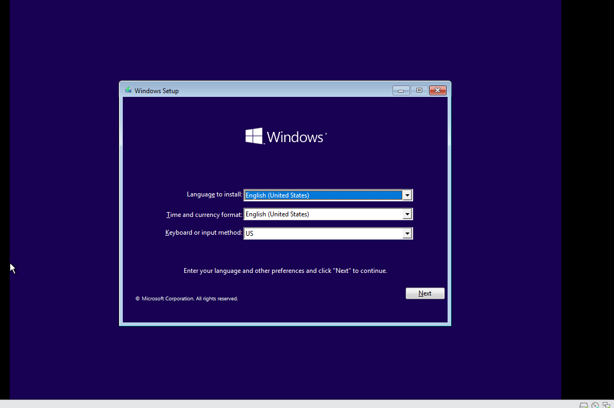
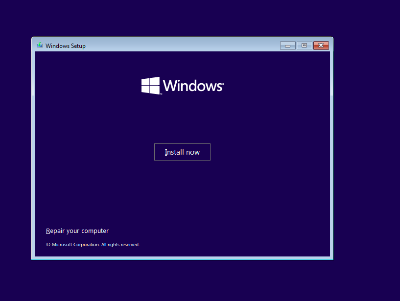
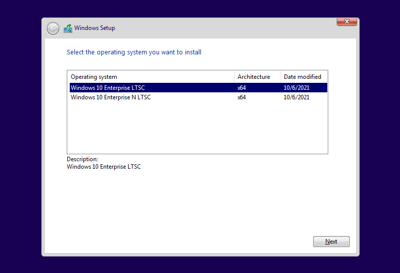
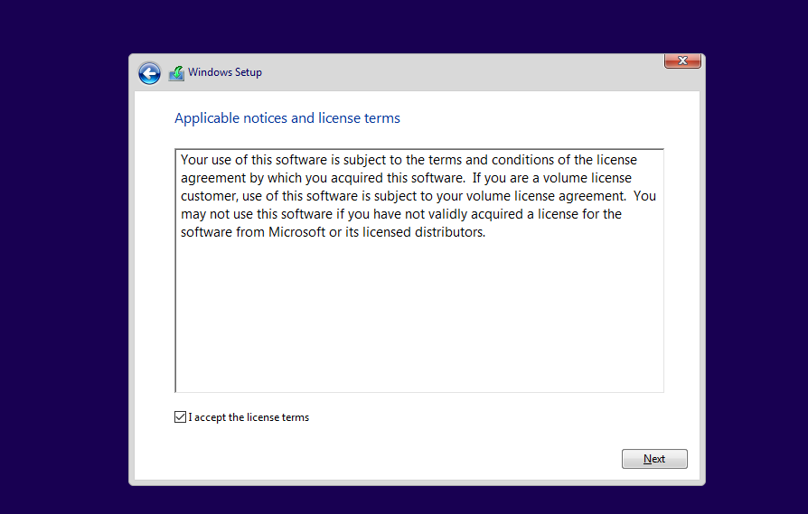
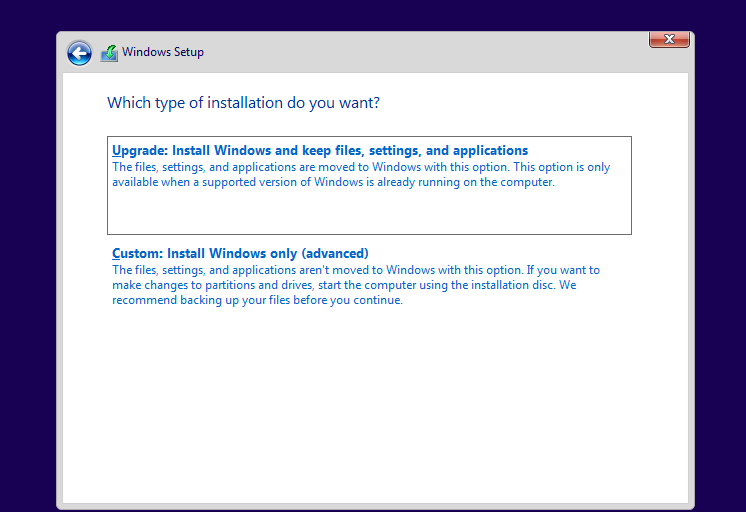
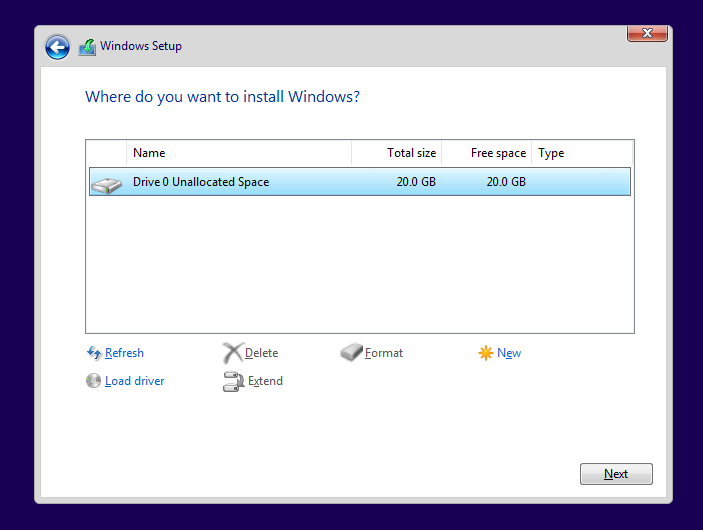
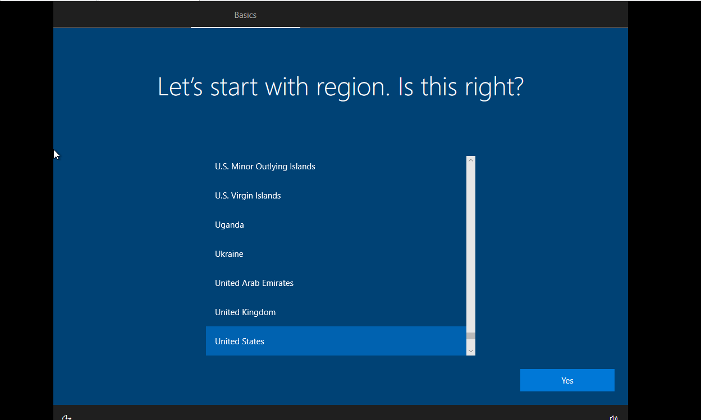
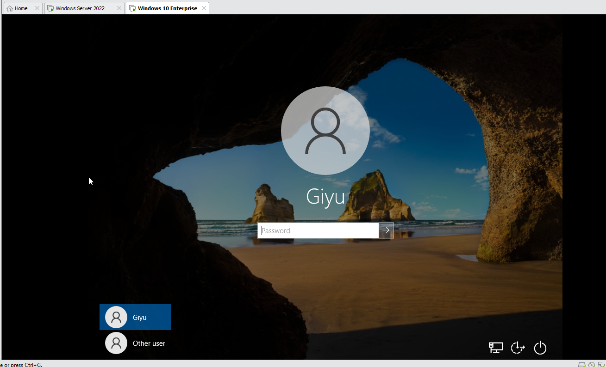
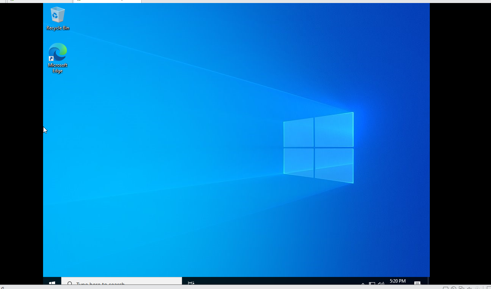

# Windows Server 2022 — Installation & Initial Setup

## Description

A walkthrough detailing the initial deployment and installation process of Windows Server 2022 Standard (Desktop Experience) in a virtualized lab environment using VMware Workstation. 
This setup serves as the foundational domain controller/server instance for enterprise lab simulation and Active Directory configuration.

## Environment Used

- Windows Server 2022
- VMware Workstation

## Lab walk-through

Select installation language, time and currency format, and keyboard input method.
  

Click "Install now" to initiate the Windows 10 setup wizard.
  

Select the Windows 10 Enterprise LTSC operating system edition.
  

Accept the applicable Microsoft notices and software license terms.
  

Select "Custom: Install Windows only (advanced)" for a fresh operating system deployment.
  

Choose the unallocated drive partition to allocate virtual storage for the OS install.
  

Configure Out-of-Box Experience (OOBE) regional and basic localization settings.
  

Reach the Windows 10 lock screen and verify the local account prompt.
  

Verify successful OS installation and access the clean Windows 10 desktop interface.   
  

